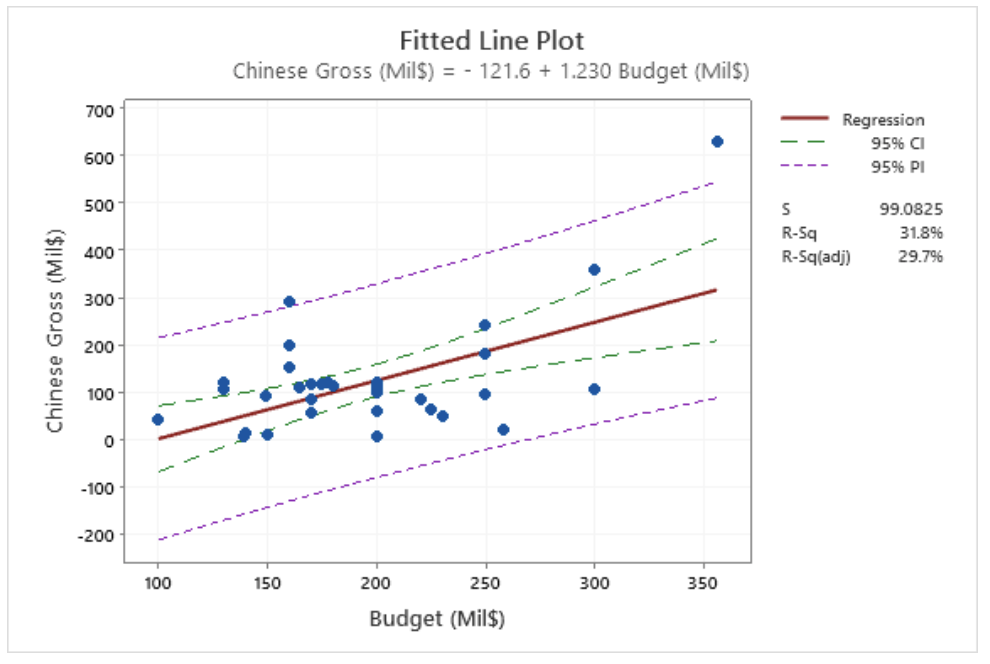
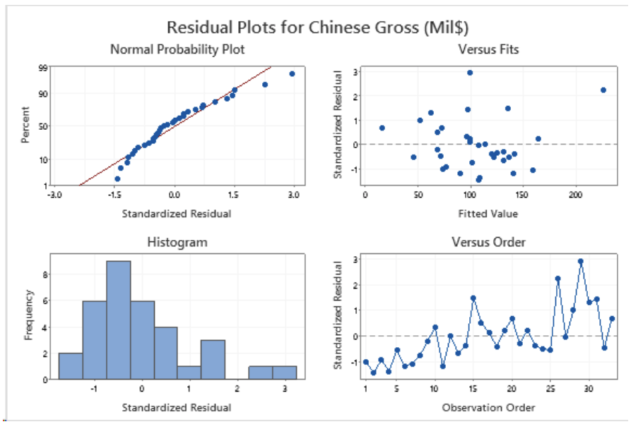
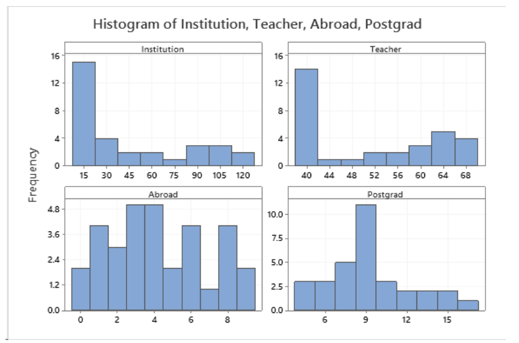
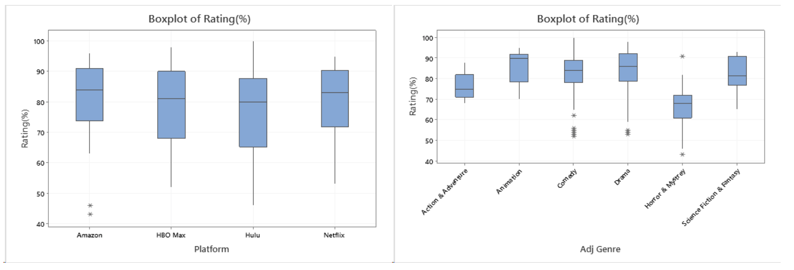
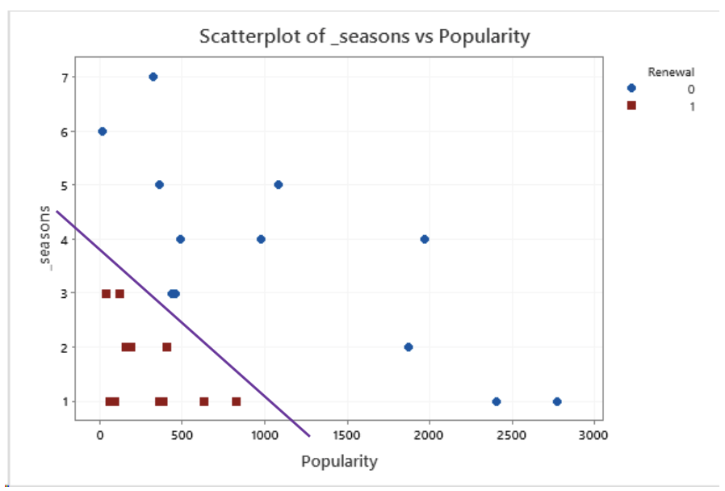

# Regression-Reports

STAT-GB 2301/STAT-UB 17 Regression and Multivariate Data Analysis | Spring 2021 | 5 reports

## Note

There are 5 homeworks/reports throughout the semester. The stats software of choice is Minitab. Please check `hw1` to `hw5` directories for the pdf reports, datasets and minitab commands.

### Report 1: Linear Regression - single numerical predictor

Superhero Movie Performance in China: How Profitable are They?

### Report 2: Linear Regression - multiple numerical predictors

Superhero Movie Performance in China: How Profitable are They?

### Report 3: Linear Regression - Time Series

Time Series Analysis: Grad School or Not?

### Report 4: 2-way ANOVA

Video Streaming Platform: Which Has Better Shows?

### Report 5: Logistic Regression - multiple numerical predictors

Netflix TV Shows: Renewal or Cancellation?

